# Create Groups and Locations using Setup Excel Template

In this lab exercise we will create a organization hierarchy (Groups and Locations) in Envizi similar to the below picture using Setup excel template.

#### Pre-Requisite

1. Get your `Prefix-Id` from your Instructor. This id to be prefixed in all your data to avoid duplicate records. Your `Prefix-Id` could be in the format `A11`, `A12`.
2. Get the `Organization` name from Instructor.

#### About Setup Excel Template
The Setup excel template enables performing the following operations via an Excel template.

- Create grouping structure (up to 3 levels)
- Create and update locations
- Assign Locations to multiple group structures
- Move locations between existing groups

This document explains about how to perform those operations.

#### Key steps

Here are the key steps in this process:
1. Download the Envizi excel template called `Envizi_SetupGroups` and `Envizi_Locations`
2. Update the template according to the provided organizational hierarchy.
3. Upload the template file into Envizi to create the hierarchy in Envizi.

# 1. Create Groups

Lets us create Groups.

## 1.1 Understand the template

Let us understand the Envizi_SetupGroups template.

#### Group (L1)

The excel template to create `Group` will be like this.

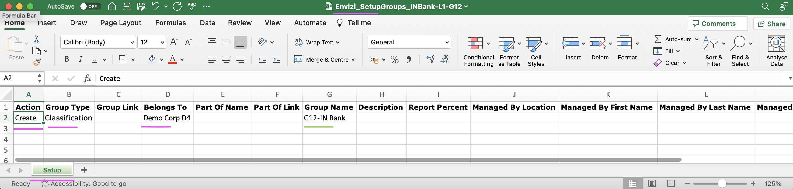

1. The below columns needs to be filled in.
- Action : It can be `Create` or `Update` based on whether you create a new Group or updating the existing group.
- Group Type: `Classification`
- Belongs To: The Organization name of this group.
- Group Name: Name of the group that we are going to create.

2. The name of the sheet should be `Setup`

3. File name of the excel should be `Envizi_SetupGroups_XXXXXX.xlsx`

#### SubGroup (L2, L3)

The excel template to create `sub groups` will be like this.

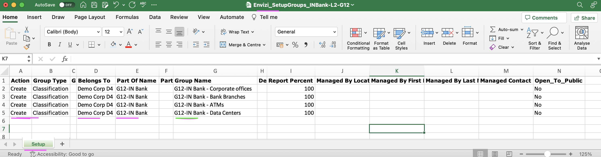

1. The below columns needs to be filled in.
- Action : `Create` or `Update`.
- Group Type : `Classification`
- Belongs To : The Organization name of this group.
- Part of Name : The parent group name (L1 or L2).
- Group Name : Name of the subgroup that is going to be created.

2. The name of the sheet should be `Setup`

3. File name of the excel should be `Envizi_SetupGroups_XXXXXX.xlsx`

## 1.2 Download the Template

1. Download the Envizi_SetupGroups excel template here [311-Envizi_SetupGroups_template.xlsx](./files/311-Envizi_SetupGroups_template.xlsx). Get the file from the shared folder, if the link is not working.
## 1.3. Populate Template with Groups

Lets populate the template with the groups from the above organization hierarchy.

### 1.3.1 Group L1

1. Take a copy of the template `Envizi_SetupGroups_template.xlsx` 
2. Rename the file in the format `Envizi_SetupGroups_xxxxx.xlsx`. Here xxxxx could be anything. You can replace it with your `Prefix-Id`. ex: Envizi_SetupGroups_INBank-L1-G12.xlsx
3. Based on the above Org Hierarchy fill in the `L1` group as like below.
 

### 1.3.2 Group L2

1. As above
2. As above ex: Envizi_SetupGroups_INBank-L2-G12.xlsx
3. Based on the above Org Hierarchy fill in the `L2` group as like below.
 

### 1.3.3 Group L3

1. As above
2. As above ex: Envizi_SetupGroups_INBank-L3-G12.xlsx
3. Based on the above Org Hierarchy fill in the `L3` group as like below.
 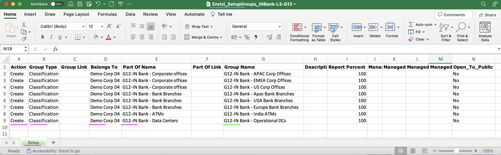

#### Important
To stay aligned with the subsequent labs, we recommend using the Prepopulated template file discussed in the following section for the upcoming steps.

## 1.4 Preparing the Prepopulated Template

Lets download the Prepopulated Template file and do the required changes.

1. Download the Prepopulated Template files [313-Envizi_SetupGroups_INBank-L1-G12.xlsx](./files/313-Envizi_SetupGroups_INBank-L1-G12.xlsx), [314-Envizi_SetupGroups_INBank-L2-G12.xlsx](./files/314-Envizi_SetupGroups_INBank-L2-G12.xlsx), [315-Envizi_SetupGroups_INBank-L3-G12.xlsx](./files/315-Envizi_SetupGroups_INBank-L3-G12.xlsx). Get the files from the shared folder, if the links are not working.
2. The file name format should be `Envizi_SetupGroups_xxxxx.xlsx`. Replace xxxx with your preferred text. But it is better to use your `Prefix-Id`.
3. Replace the `Belongs To` column values with Organization name you obtained as a prerequisite.
4. To prevent naming conflicts, replace the prefix `G12` with your `Prefix-Id` in the `Part Of Name` and `Group Name` columns. For example, transform `G12-IN Bank - Data Centers` to `A12-IN Bank - Data Centers`.

The Prepopulated Template file is ready for upload now.

## 1.5 Upload the template file into Envizi

Lets us upload the above updated template file into Envizi for to create Groups.

### 1.5.1 Upload the file L1

1. Navigate to Envizi UI. 

2. Click on `Manage > Upload files` to upload the file.
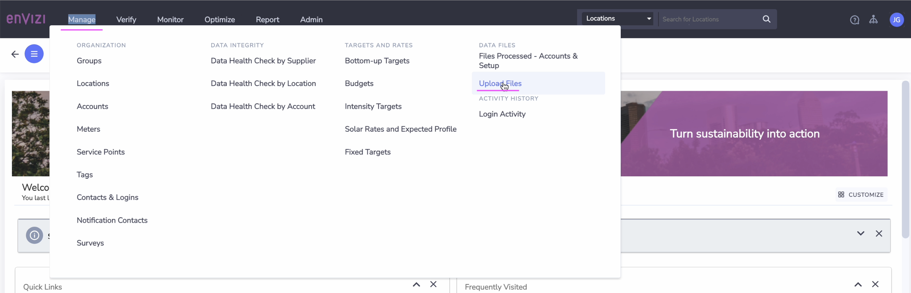

4. Click on `Create New uploads` .
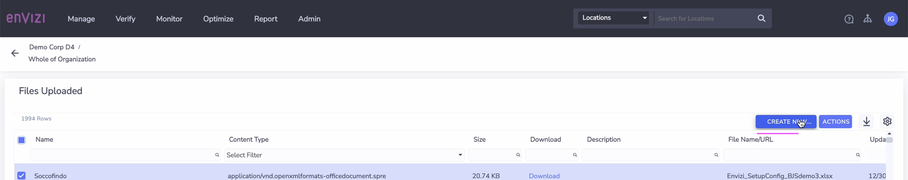

5. Upload the file. Click on `Save` .
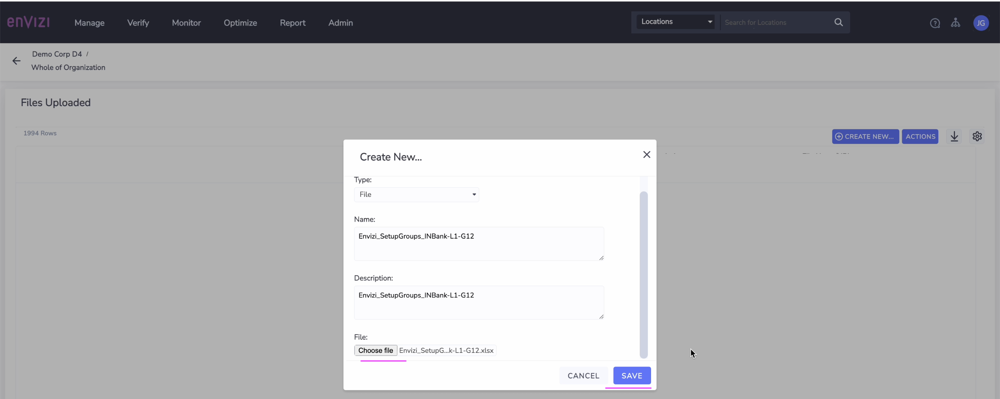
File is uploaded

### 1.5.2 Verify Upload Status L1

1. Navigate to `Manage > Files Processed - Accounts & Setup` 
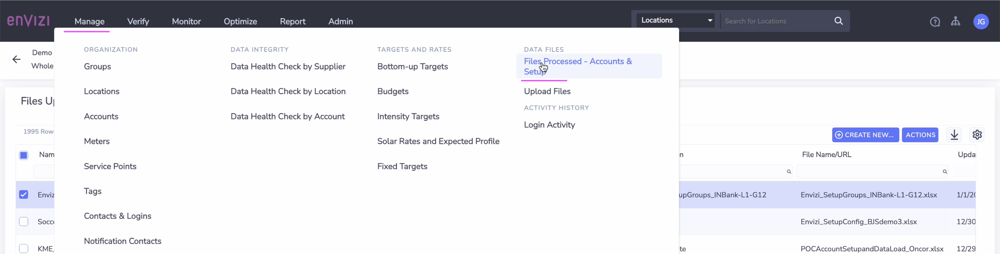

2. View  the status of the file. You should see the file status changed to `Loaded` 
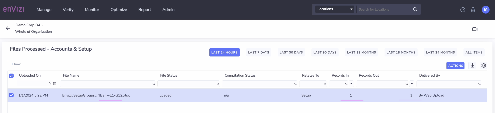

4. Observe  `Records In ` and `Records Out` fields on the same page.

Note: If the file doesn't appear in the Files Processed page, then please review the file - check tab name (Setup), organization name, etc.

### 1.5.3 Upload and Verify L2 and L3

1. Upload L2 file
2. Upload L3 file
3. Verify the uploaded files. It should be like this.
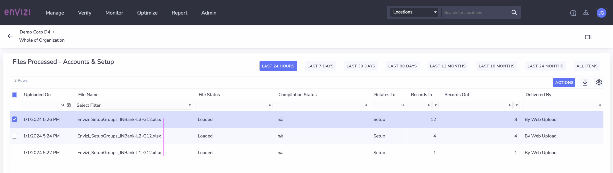

## 1.6 Verify Groups

Lets look into the Group Hierarchy.

1. Click on `Manage` > `Groups` on left side of the Envizi UI 

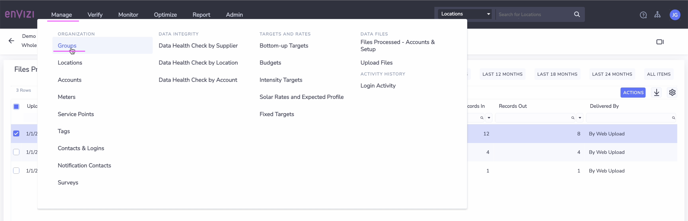

2. Filter the `Name` column with your `Prefix-Id`
3. See all the Groups created

# 2. Create Locations

Lets us create Locations.

## 2.1 Understand the template

Let us understand the Envizi_SetupLocations template.

The excel template to create `Location` will be like this.

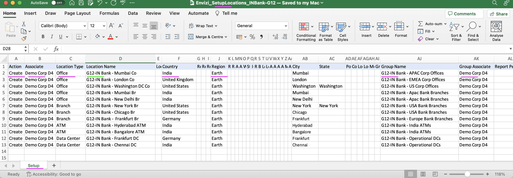

1. The below columns needs to be filled in.
- Action : `Create` or `Update`.
- Associate : The Organization name of this location.
- Location Name : Name of the location that is going to be created.
- Country: Country where the location belongs to.
- Region: Region where the location belongs to.
- Group Name : Name of the group/subgroup under which the location is going to get created.
- Group Associate : The Organization name of this Group.

2. The name of the sheet should be `Setup`

3. File name of the excel should be `Envizi_SetupLocations_XXXXXX.xlsx`

## 2.2 Download the Template

1. Download the Envizi_SetupLocations excel template here [312-Envizi_SetupLocations_template.xlsx](./files/312-Envizi_SetupLocations_template.xlsx). Get the file from the shared folder, if the link is not working.

## 2.3. Populate Template with Locations

Lets Populate the template with the locations from the above organization hierarchy.

1. Take a copy of the template `Envizi_SetupLocations_template.xlsx` 
2. Rename the file in the format `Envizi_SetupLocations_xxxxx.xlsx`. Here xxxxx could be anything. You can replace it with your `Prefix-Id`. ex: Envizi_SetupLocations_INBank-G12.xlsx
3. Based on the above Org Hierarchy fill in the `locations` as like below.
 

#### Important
To stay aligned with the subsequent labs, we recommend using the Prepopulated template file discussed in the following section for the upcoming steps.

## 2.4 Preparing the Prepopulated Template

Lets download the Prepopulated Template file and do the required changes.

1. Download the Prepopulated Template file here [316-Envizi_SetupLocations_INBank-G12.xlsx](./files/316-Envizi_SetupLocations_INBank-G12.xlsx). Get the file from the shared folder, if the link is not working.
2. The file name format should be `Envizi_SetupLocations_xxxxx.xlsx`. Replace xxxx with your preferred text. But it is better to use your `Prefix-Id`. 
3. Replace the `Associate` and `Group Associate` column values with Organization name you obtained as a prerequisite.
4. To prevent naming conflicts, replace the prefix `G12` with your `Prefix-Id` in the `Location Name` and `Group Name` columns. For example, transform `G12-IN Bank - London Co` to `A12-IN Bank - London Co`.

The Prepopulated Template file is ready for upload now.

## 2.5 Upload the template file into Envizi

Lets upload the above updated template file into Envizi to create locations in Envizi.

1. Follow the steps given [here](../201-uploading-a-file) to upload the file into Envizi.

## 2.6 Verify Location

Lets look into the Group Hierarchy.

1. Click on `Manage` > `Location` on left side of the Envizi UI 
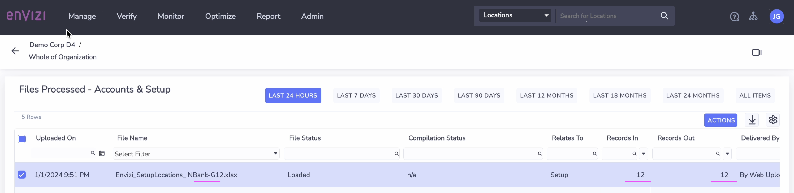

2. Filter the `Name` column with your `Prefix-Id`
3. See all the Locations created
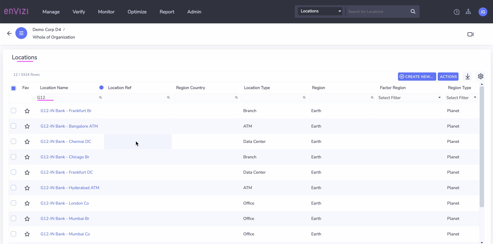

## 3 Verify Organization Hierarchy

Lets look into the Group and Location Hierarchy.

1. Click on `Show Organization Hierarchy` on left side of the Envizi UI 
2. Expand the `Classification Groups`
2. Choose the Group that you have created using your `Prefix-Id`
3. Drill down on a group to view the sub groups and the locations attached. 
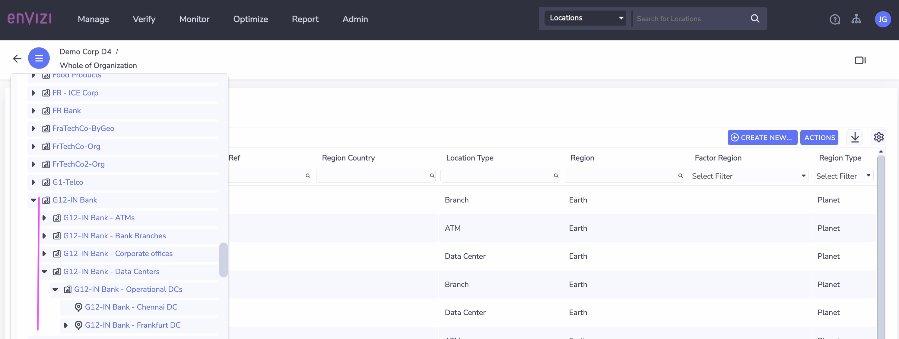

## 4 Next steps

In this lab, you have learned how to Setup templates to create an Organization Hierarchy with the relevant groups and associated locations. 

In the next lab, you will learn how to capture different types of data for these locations. 