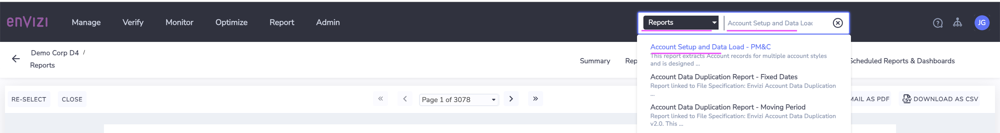
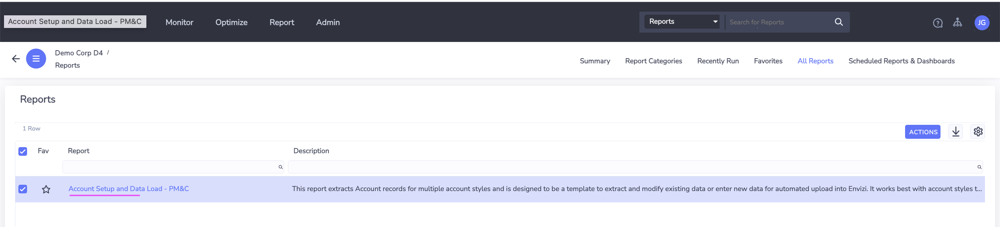
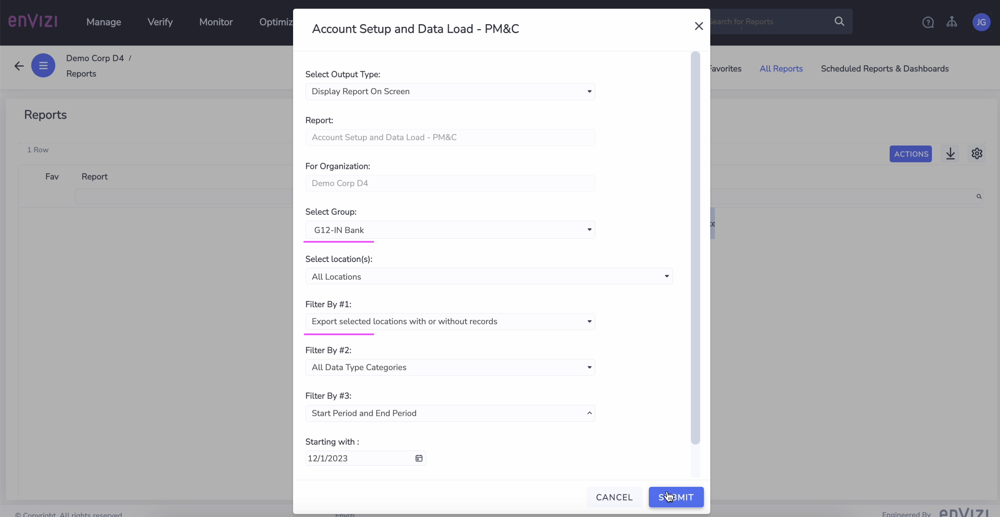
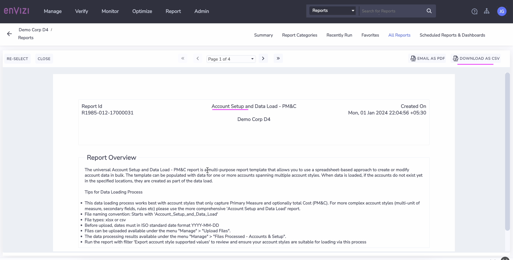
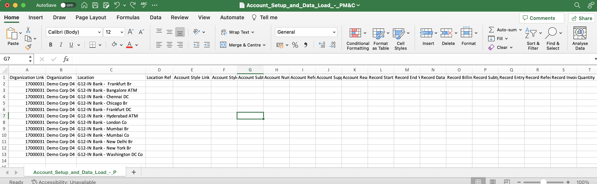
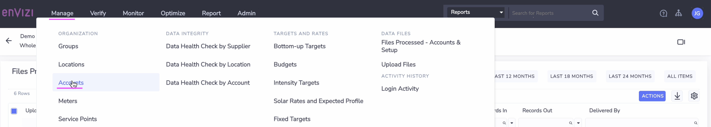
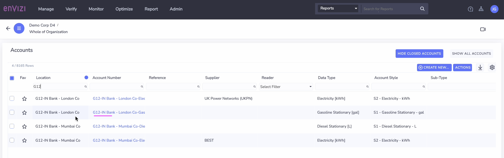
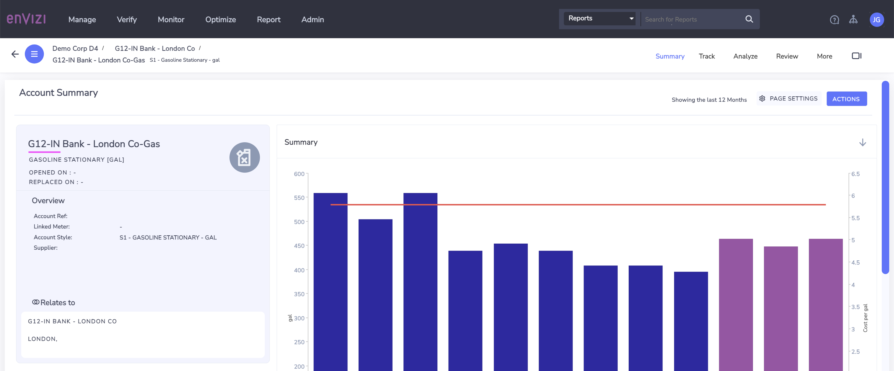
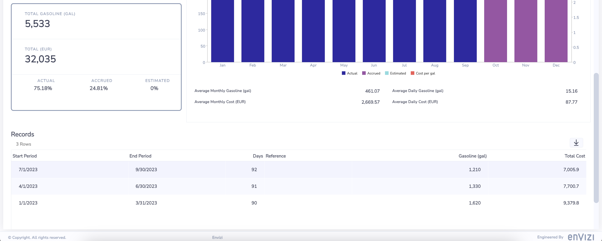

# Account Setup and Data Load - PM&C

This is called as `Universal Account Setup and Data Loading Process - PM&C Multiple Account Styles`

In this lab exercise we will create Account and Data in Envizi similar to the below picture using `Account Setup and Data Load - PM&C` excel template.

- The template can be populated with data for one or more accounts spanning `multiple account styles`. 
- This data loading process works best with account styles that only capture `Primary Measure` and optionally total `Cost` (PM&C). 

#### Additional info regarding this Process

- The universal Account Setup and Data Load - PM&C report is a multi-purpose report template that allows you to use a spreadsheet-based approach to create or modify account data in bulk. 
- The template can be populated with data for one or more accounts spanning `multiple account styles`. 
- When data is loaded, if the accounts do not exist yet in the specified locations, they are created as part of the data load.
- This data loading process works best with account styles that only capture Primary Measure and optionally total Cost (PM&C). 
- For more complex account styles (multi-unit of measure, secondary fields, rules etc) please use the more comprehensive 'Account Setup and Data Load' report.
- Run the report with filter 'Export account style supported values' to review and ensure your account styles are suitable for loading via this process

#### Pre-Requisite

1. Get your `Prefix-Id` from your Instructor. This id to be prefixed in all your data to avoid duplicate records. Your `Prefix-Id` could be in the format `A11`, `A12`.
2. Get the `Organization` name from Instructor.

#### Key steps

The key steps in this process are as follows.
- Download the Template file from Envizi Report
- Prepare Data in the downloaded file
- Upload the file into Envizi
- View the Accounts and Data in Envizi

## 1. Download the Template

Need to download the Template file from Envizi Report.

1. Search for `Account Setup and Data Load - PM&C` in Reports

2. Open the report

3. Choose the following 
- **Select Group:** Your `IN Bank` group. ex: `G12-IN Bank`
- **Filter By #1:**  Export selected locations with or without records

4. Click on `Submit`

Report is displayed on the screen.

5. Click on `DOWNLOAD AS CSV`

You may get the csv file as like this [321-Account_Setup_and_Data_Load_-_PM&C.csv](./files/321-Account_Setup_and_Data_Load_-_PM&C.csv). Get the file from the shared folder, if the link is not working.

## 2 Understand the template

Let us understand the above downloaded Account_Setup_and_Data_Load_-_PM&C template.

1. The below columns needs to be filled in.
- **Account Style Link      :**  ReferenceId of the Account Style. Refer [here](../203-account-style-link) to know how to get the `Account Style Link` of an `Account Style`.
- **Account Style Caption   :**  Account Style value
- **Account Number          :**  Account Name to be created.
- **Record Start YYYY-MM-DD :**  Start Date of the data
- **Record End YYYY-MM-DD   :**  End date of the data
- **Quantity                :**  Quanity of the data
- **Total Cost              :**  Cost of the data

2. This template shows several account styles and it proves that using this template we can upload data for several account styles.

3. The consumption data and cost can be give in the `Quantity` and `Total cost` columns.

4. File name of the excel should be `Account_Setup_and_Data_Load_-_PM&C_XXXXXX.xlsx`

## 3. Populate Template with Accounts and Data

Lets Populate the template with the locations from the above organization hierarchy.

1. Open the downloaded file in excel.

2. Save as the file into `Account_Setup_and_Data_Load_-_PM&C_xxxxx.xlsx`. Here xxxxx could be anything. You can replace it with your `Prefix-Id`.

3. Based on the above Org Hierarchy fill in the `accounts` and `data`  as like below.

Here we used the below account styles.
- 22227 -> S1 - Diesel Stationary - L
- 14445 -> S2 - Electricity - kWh
- 14492 -> S1 - Gasoline Stationary - gal

If these account styles are not available in your instance you can choose few on your own.  For Example, 
- 23139	Diesel - L
- 11075	Electricity - kWh
- 11096	Natural Gas - kWh

#### Important
To stay aligned with the subsequent labs, we recommend using the Prepopulated template file discussed in the following section for the upcoming steps.

## 4 Preparing the Prepopulated Template

Lets download the Prepopulated Template file and do the required changes.

1. Download the Prepopulated Template file here [322-Account_Setup_and_Data_Load_-_PM&C_G12.xlsx](./files/322-Account_Setup_and_Data_Load_-_PM&C_G12.xlsx). Get the file from the shared folder, if the link is not working.
2. The file name format should be `Account_Setup_and_Data_Load_-_PM&C_xxxxx.xlsx`. Replace xxxx with your preferred text. But it is better to use your `Prefix-Id`. 
3. Replace the `Organization Link` column value with available in the report you downloaded.
4. Replace the `Organization` column value with Organization name you obtained as a prerequisite.
5. `Account Style Link` :  Reference Id of the Account Style. Refer [here](../203-account-style-link) to know how to get the `Account Style Link` of an `Account Style`.

 Here we used the below account styles.
- 22227 -> S1 - Diesel Stationary - L
- 14445 -> S2 - Electricity - kWh
- 14492 -> S1 - Gasoline Stationary - gal

These account styles may not be available in your instance. You have to find and use the appropriate account styles based on your instance. For Example
- 23139	Diesel - L
- 11075	Electricity - kWh
- 11096	Natural Gas - kWh

6. To prevent naming conflicts, replace the prefix `G12` with your `Prefix-Id` in the `Account Number` column. For example, transform `IN Bank - London Co-Gas` to `A12-G12-IN Bank - London Co-Gas`.

The Prepopulated Template file is ready for upload now.

## 5. Upload the file into Envizi

Need to upload the file into Envizi.

1. Click on `Manage > Upload files` to upload the file.

Refer [here](../201-uploading-a-file) for the detailed steps about how to upload a file into Envizi.

## 6. View the Accounts and Data

Lets view the created/updated data in Envizi.

1. Click on `Manage > Accounts` to view the created Accounts and Data

2. Open the required account.

3. View the  `Account Summary` page.

### Reference 

1. Universal Account Setup and Data Loading Process - PM&C Multiple Account Styles capturing Primary Measure and Cost
https://knowledgebase.envizi.com/home/universal-account-setup-and-data-loading-process-p
