# Account Setup and Data Load

This is called as `Universal Account Setup and Data Loading Process - Single Account Style`

In this lab exercise we will create Account and Data in Envizi using `Account Setup and Data Load` excel template.

- To create or modify account data in bulk. 
- The template can be populated with data for one or more accounts, if they belong to the same account style
- If the accounts do not exist yet in the specified locations, they are created as part of the data load.

#### Pre-Requisite

1. Get your `Prefix-Id` from your Instructor. This id to be prefixed in all your data to avoid duplicate records. Your `Prefix-Id` could be in the format `A11`, `A12`.
2. Get the `Organization` name from Instructor.

#### Key steps

The key steps in this process are as follows.
- Download the Template file from Envizi Report
- Prepare Data in the downloaded file
- Upload the file into Envizi
- View the Accounts and Data in Envizi

# 1. Create Account and Data

Let us create an account and load data into it.

Let us take `Hotel Stays` as an account style and run the below steps. 

**Note:** This account style may not exists in your organization instance. In that case you have to choose another account style. Goto `Manage > Account Style` link and find out a style. Ex: `Business Travel - Air - tCO2e`

CLICK ME

## 1.1 Download the Template

Need to download the Template file from Envizi Report.

1. Search for `Account Setup and Data Load` in Reports

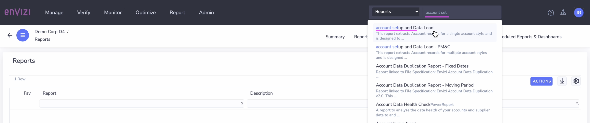

2. Open the report

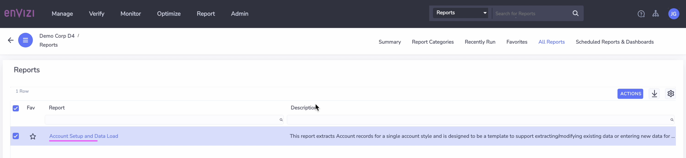

3. Choose the following 
- **Filter By #1:**  Export selected locations with or without records
- **Filter By #2:**  Hotel Stays or As per your wish

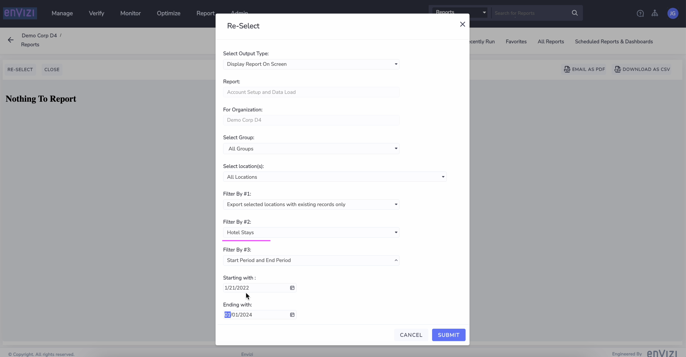

4. Click on `Submit`

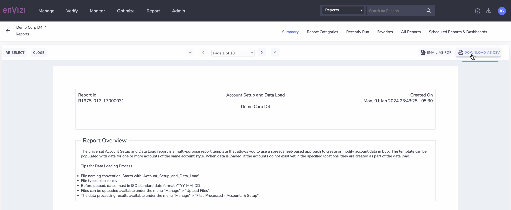

Report is displayed on the screen.

5. Click on `DOWNLOAD AS CSV`

You may get the csv file as like [331-Account_Setup_and_Data_Load.csv](./files/331-Account_Setup_and_Data_Load.csv). Get the file from the shared folder, if the link is not working.

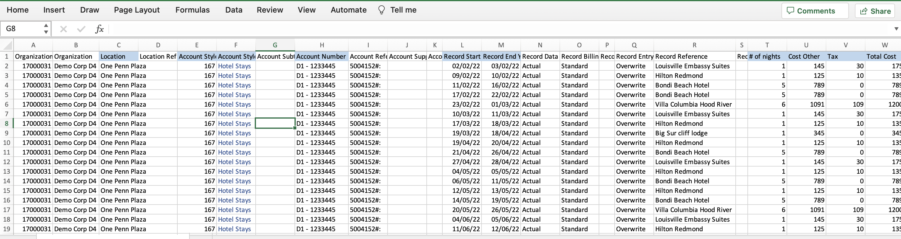

## 1.2 Understand the template

Let us understand the Account_Setup_and_Data_Load template.

1. The below columns needs to be filled in.
- **Account Style Link      :**  ReferenceId of the Account Style. Refer [here](../203-account-style-link) to know how to get the `Account Style Link` of an `Account Style`.
- **Account Style Caption   :**  Account Style value
- **Account Number          :**  Account Name to be created.
- **Record Start YYYY-MM-DD :**  Start Date of the data
- **Record End YYYY-MM-DD   :**  End date of the data
- **C# of nights            :**  Number of nights in hotel
- **Cost Other              :**  Cost spend
- **Tax                     :**  Tax for the cost spend
- **Total Cost              :**  Total Cost of the data

Note: Here the last 4 columns may vary between each account styles. 

2. File name of the excel should be `Account_Setup_and_Data_Load_XXXXXX.xlsx`

## 1.3. Populate Template with data (Optional)

Lets populate the above template with the `Hotel Stays` account style based on the organization hierarchy.

1. Open the downloaded file in excel.

2. Save as the file into `Account_Setup_and_Data_Load_xxxxx.xlsx`. Here xxxxx could be anything. You can replace it with your `Prefix-Id`.

3. Removed the unwanted records and create the records as like below.
 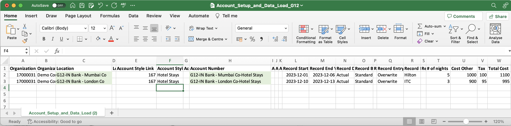

#### Important
To stay aligned with the subsequent labs, we recommend using the Prepopulated template file discussed in the following section for the upcoming steps.

## 1.4 Preparing the Prepopulated Template

Lets download the Prepopulated Template file and do the required changes.

1. Download the Prepopulated Template file [332-Account_Setup_and_Data_Load_G12.xlsx](./files/332-Account_Setup_and_Data_Load_G12.xlsx). Get the file from the shared folder, if the link is not working.
2. The file name format should be `Account_Setup_and_Data_Load_xxxxx.xlsx`. Replace xxxx with your preferred text including your `Prefix-Id`. 
3. Replace the `Organization Link` column value with available in the report you downloaded.
4. Replace the `Organization` column value with Organization name you obtained as a prerequisite.
5. To prevent naming conflicts, replace the prefix `G12` with your `Prefix-Id` in the `Location` and `Account Number` column. For example, transform `G12-IN Bank - London Co-Hotel Stays` to `A12-IN Bank - London Co-Hotel Stays`.
6. Replace the `Account Style Link` with the id of the Account Style. Refer [here](../203-account-style-link) to know how to get the `Account Style Link` of an `Account Style`.

The Prepopulated Template file is ready for upload now.

## 1.5. Upload the file into Envizi

Need to upload the file into Envizi.

1. Click on `Manage > Upload files` to upload the file.

Refer [here](../201-uploading-a-file) for the detailed steps about how to upload a file into Envizi.

## 1.6. View the Accounts and Data

Lets view the created/updated data in Envizi.

1. In the Global Search Click on `Reports` > `G12-IN Bank - London Co-Hotel Stays`

2. Open the  account.

3. View the  `Account Summary` page.

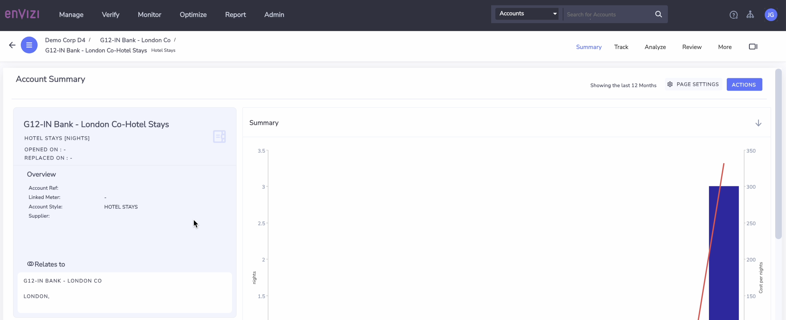
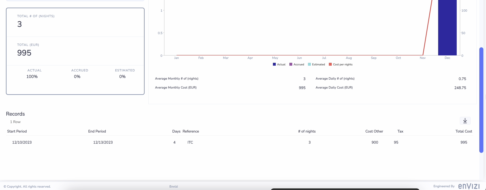

# 2. Update Data

CLICK ME

## 2.1 Download the Template

Need to download the Template file from Envizi Report.

1. Search for `Account Setup and Data Load` in Reports

2. Open the report

3. Choose the following 
- **Select Group:  :**  Your L1 group name (G12-IN Bank)
- **Filter By     #1:**  Export selected locations with existing records only
- **Filter By     #2:**  Hotel Stays or the value you have given in the previous section.

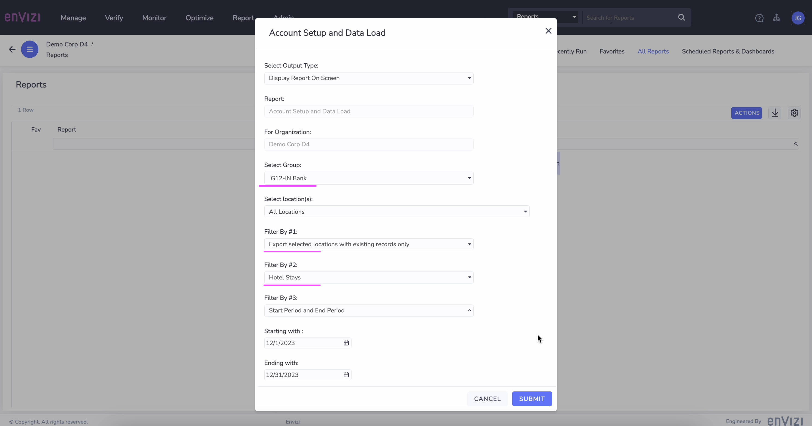

4. Click on `Submit`

Report is displayed on the screen.

5. Click on `DOWNLOAD AS CSV`

You may get the csv file as like [333-Account_Setup_and_Data_Load_IN-Bank-downloaded.csv](./files/333-Account_Setup_and_Data_Load_IN-Bank-downloaded.csv). Get the file from the shared folder, if the link is not working.

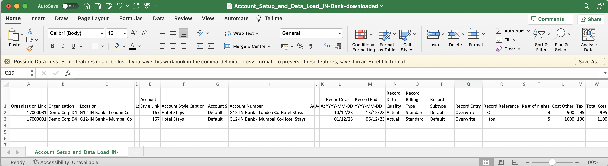

## 2.2 Preparing the Prepopulated Template

Lets download the Prepopulated Template file and do the required changes.

1. Download the Prepopulated Template file [334-Account_Setup_and_Data_Load_G12-updated.xlsx](./files/334-Account_Setup_and_Data_Load_G12-updated.xlsx). Get the file from the shared folder, if the link is not working.
2. The file name format should be `Account_Setup_and_Data_Load_xxxxx.xlsx`. Replace xxxx with your preferred text. But it is better to use your `Prefix-Id`. 
3. Replace the `Organization Link` column value with available in the report you downloaded.
4. Replace the `Organization` column value with Organization name you obtained as a prerequisite.
5. To prevent naming conflicts, replace the prefix `G12` with your `Prefix-Id` in the `Location` and `Account Number` column. For example, transform `G12-IN Bank - London Co-Hotel Stays` to `A12-IN Bank - London Co-Hotel Stays`.
6. Account Style Link      : ReferenceId of the Account Style. Refer [here](../203-account-style-link) to know how to get the `Account Style Link` of an `Account Style`.

The Prepopulated Template file is ready for upload now.

There is an `update to the London` record and `insert into the Mumbai` record

## 2.3 Upload the file into Envizi

Need to upload the file into Envizi.

1. Click on `Manage > Upload files` to upload the file.

Refer [here](../201-uploading-a-file) for the detailed steps about how to upload a file into Envizi.

## 2.4. View the Accounts and Data

Lets view the created/updated data in Envizi.

1. View the  `Account Summary` page for the account `G12-IN Bank - London Co-Hotel Stays`

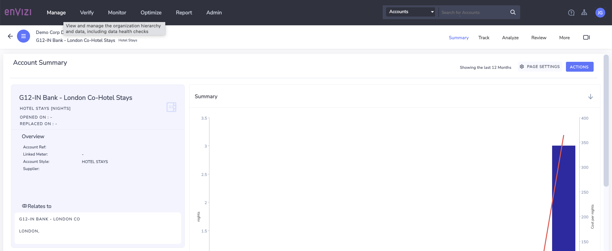
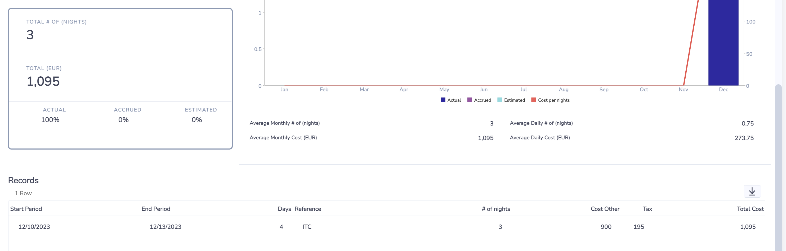

2. View the  `Account Summary` page for the account `G12-IN Bank - Mumbai Co-Hotel Stays`
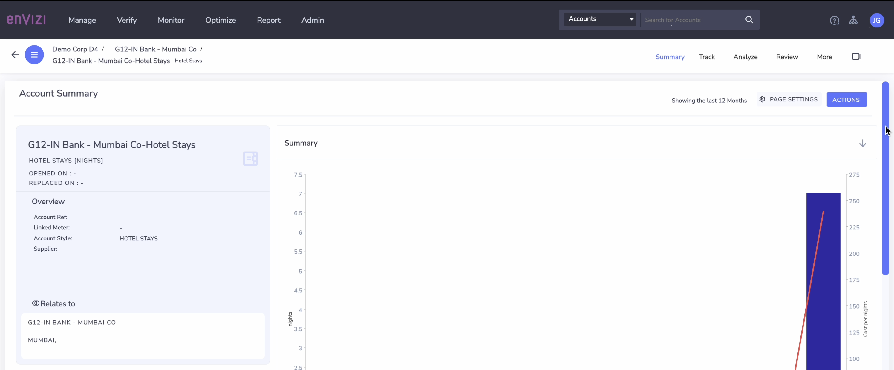
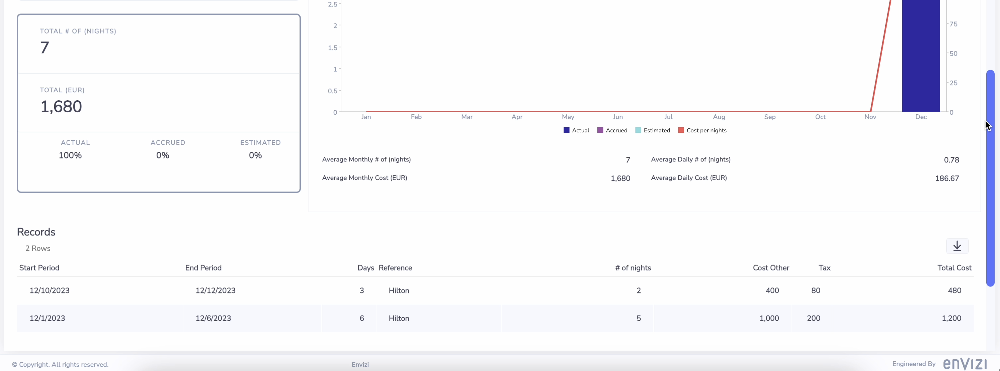

### Reference 

1. Universal Account Setup and Data Loading Process - Single Account Style All Fields
https://knowledgebase.envizi.com/home/universal-account-setup-and-data-loading-process
