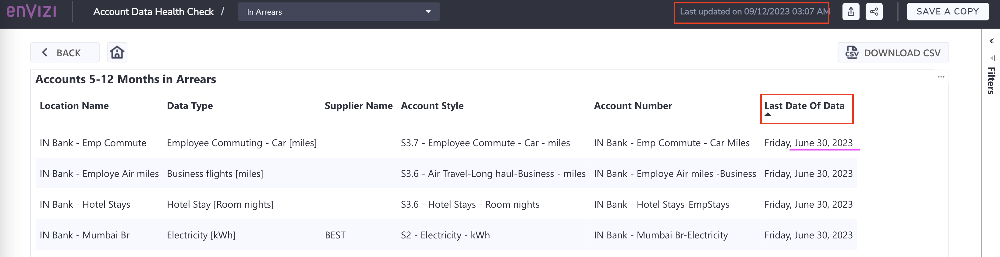
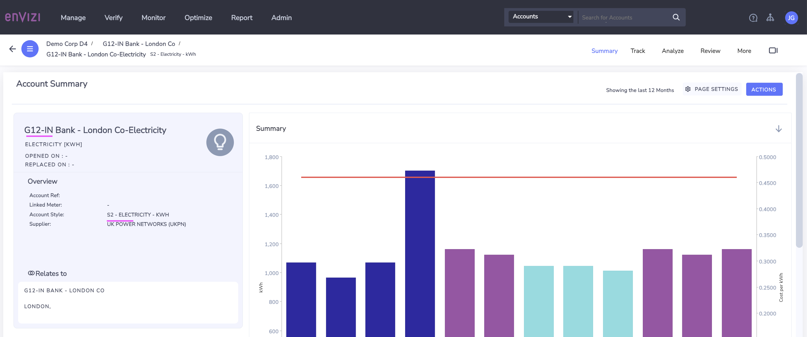
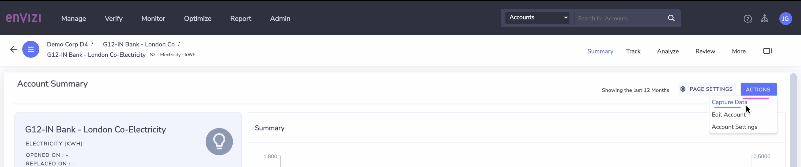
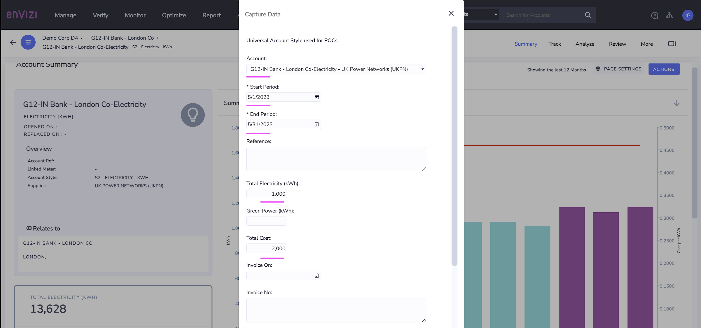
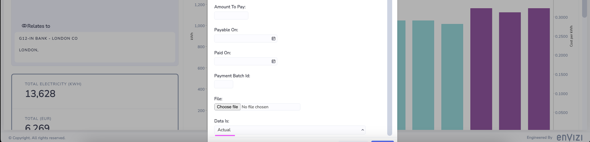
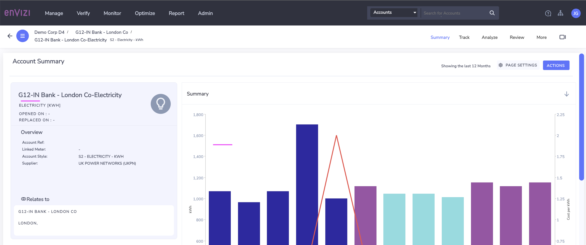
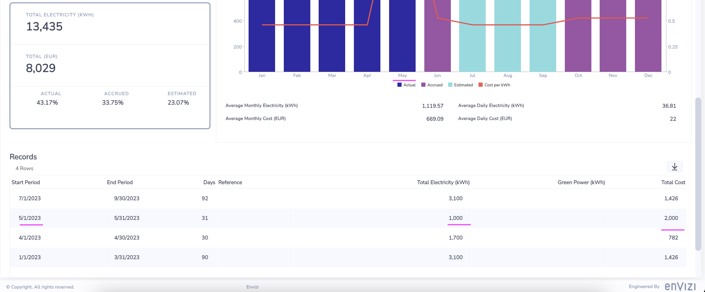

# Monitor Health of Data and identify issues

In this lab exercise we will monitor the health of the data by looking into Envizi Reports available out of the box. The Reports will provide the details on data gaps / arrears , etc at various levels such as  account, data type, Supplier level.  Based on the insights from the reports, we will take necessary actions to address the gaps / arrears.

# 1. Check Data Quality of the Accounts

Envizi provides the below reports to understand the quality of data and also helps us to identify the gaps / missing data so that users can take necessary action. 

- Account Data health check 
- Account Incomplete Report

## 1.1.Account Data health check report (Power report)

Account Data health check is a power report which helps us to analyze health of data loaded into the accounts in Envizi. By looking into the report, the data capture team can understand what % of accounts have the data captured in last 4 months and what is the % of accounts for which data need to be catpured. 

In this section we will go through these reports and get the insights on the data which we have so far loaded into accounts for our organization. 

### 1.1.1 Report Home

CLICK ME

### Open Account Data health Check report

1. In the Global Search ->  Choose `Reports` from the drop-down and enter `health` in the text box to search for the report. 

2. Click on the `Account Data health Check` PowerReport from the results.

3. View the  report opened in new browser tab, which provides Account health details across overall organization

   

### Apply Filter for Group Level 1

1. Click `Group Filter` on right-hand corner and select your group in `Group Level 1` ( Ex: `IN Bank`) and close

Now, the page shows `Data Activity` and `Data Gaps` related to the group which you have selected. 

As per the screenshot , 87% of the accounts have the data captured in last 4 months. 

 

### 1.1.2 Data Activity - Arrears

CLICK ME

1. Click on `View` under `Arrears` to look at the Accounts for which data is `NOT` captured in `last 4 months`.

### Arrears Home

2. There are few accounts for which the data is not captured in last 4 months. Click on the `Account Information` to view those accounts

 

### Account Information

Looking at the `Last Date of Data` column (eg: June 30, 2023) , the data capture team can identify that they need to capture the latest data into these accounts and work on it further.  For example, at the time of this report (refer screenhot - Last updated on 09/12/2023 03:07 AM),  its been more than 4 months  that the data is not captured into these accounts, hence identified as arrears.  

 

### 1.1.3 Data Gaps

CLICK ME

1. Lets go back to `Home` page and look at the `Data Gaps`. The bar graphs under `Data Gaps` section shows that from July 2023 there is lot of accured data, which  means the 
system has estimate the data based on previously available data because the accounts are not loaded. 

 

### Data Gaps Home

2. Click on `View` in the above screen to see more details

By default, the page opens with `last 12 months` data based on the `consumption` for `all the categories` by `Supplier`.

3. Unselect `Select All` and select only `Electricity` , 

 

### Data Gaps by Category - Electricity

This gives you more details insights on how much data is loaded, how much is estimate and accrued for this data type. 

From the screenshot you can observe the following
- more than `25%` of electricity data is missed to capture
- however `5 to 6%` of data is estimated data

You can also see the `Date Gaps by Supplier` chart, where you can see that from `which suppliers` the data is missing regularly.  

 

### Data Gaps by Supplier

4. Click on `BEST` from  `Data Gaps By Supplier` in the above screen to Drill-down on Supplier to get more insights. 

Observe the following.
- Only `55% of data captured is actual data` from Supplier `BEST` and the rest is `MISSING`. 
- Around `38% of data is accrued` 
- Around `6% of data is estimated`

So this is not good sign for data accuracy and quality. Hence there is a need to check with supplier why this data is missing to submit. 

 

### Data Gaps by Supplier in detail

5. Click on `Drill through to BEST details` in the above screen to see the more detailed view

This screen shows location wise data capture from the Supplier. You can see the below 2 locations.
- IN Bank - Mumbai Br
- IN Bank - Mumbai Co

 

### Data Gaps by Supplier in detail - Mumbai Br

6. Select `IN Bank - Mumbai Br` in the above screen.

- As you see in screenshot, `40% of data is missing` for this location. 
- Look at `Month by Month` chart, there is `NO` data supplied for this location from `July 2023` by this Supplier. 
- This is important insight which `needs attention` and required to be notified to concern location / business unit teams to address the issue. 

### Data Gaps by Supplier in detail - Mumbai Co

7. Similarly, Click on   `IN Bank - Mumbai Co` in the above screen and get insights for this location. 

 

### Data Gaps by Supplier in detail - View Accounts

8. Click on `View Accounts` on the above screen to view account-wise details. 

From screenshot , we can see that account `IN Bank - Mumbai Co-Electricity` has lot of  `Estimated` . For data accurancy, it is important to ingest the actual data, hence we will need to address this issue to load data into the system. 

9. Take a note of this account  `IN Bank - Mumbai Co-Electricity` as we will learn how to address this using issue management by raising an issue against the same.

In the next section we will also look at `Accounts Incomplete Data report` and how it helps to get more insights at account level. 

## 1.2. Accounts Incomplete Data report (extract report)

The Accounts Incomplete Data report provides details of accounts that contain `missing or overlapping data` across the reporting period selected. The report also provides information on what data has been entered in the account if missing or overlapping data is reported in order for you to have some context to the data that has been captured in other months for that account.

Lets look at what this report provides you in details.

### 1.2.1 Extract the report 

Let us Open the report and Download as CSV.

CLICK ME

1. In the Global Search ->  Choose `Reports` from the drop-down and enter `incomplete` in the text box to search for the report. 

2. Click on the `Accounts Incomplete Data` from Reports page. In `Accounts Incomplete Data` window, 
-  Select `Group` for which you want to check the Accounts data status, 
-  leave deafult to Select `Location` to `All locations` and Submit

3. Click on the `Download As CSV` and save it to your local machine.

### 1.2.2 Observe the report content

CLICK ME

### View missing data records
4. Open the file as csv or using Microsoft xls   

Look at the below columns 
- Days_In_Month
- Expected_Days_In_Month
- Days_Mismatch

   

5. Filter the rows where `Days_Mismatch` is > 0, which gives all the accounts which has missing data for 1 or more days in a given month

### Filter by Location `IN Bank - Mumbai Br`

From the report `Account Data Health check` above, we have observed that `40% of data is missing`  from location `IN Bank - Mumbai Br` of  `electricity` accounts.

Let's dig into details of this  location `IN Bank - Mumbai Br` and corresponding accounts.

6. Apply Filter on `Location` column for `IN Bank - Mumbai Br`

7. Observe the following
- data is missing for all the days starting from the month of July 2023 till Oct 2023 (at the time of report) for this account
- the account is `IN Bank - Mumbai Br-Electricity`

   

We will learn how to address this using issue management by raising an issue against the same

## 1.3 What we observed from the 2 reports

In the above exercise, we have encountered couple of accounts which having data quality issues like - missing data  or having esitmated data instead of actual data. 

- Account:  `IN Bank - Mumbai Br-Electricity` - address Missing data 
- Account:  `IN Bank - Mumbai Co-Electricity` - address Estimate data, capture actual data. 

In the next section, we will learn how to use the issue management to raise and track the issue against these data gaps and address them.

## 1.4. How to Deal with the Missing data and arrears 

We can deal with this in 3 ways.

1. Resolve using Issue Management
2. Using Account Setup and Data Load template
3. Using Capture Data in UI

# 2 Resolve using Issue Management (info only)

This is for explanatory purpose and you don't need to do this in the lab.

In this section, we will raise issues against the accounts and assign to an user who is resposbile to capture the actual data.  

We have detailed the below steps for the account `IN Bank - Mumbai Br-Electricity`. We don't focus on the account `IN Bank - Mumbai Co-Electricity` 

### 2.1 Open the Account Summary Page

CLICK ME

1. In Global Search, search for the Account `IN Bank - Mumbai Br-Electricity` and Open the Account Summary page.

2. On Account Summary page, right-hand corner, click on `Show / hide Preview Panel`

3. Click on Scroll down button in `Issues` section.

### 2.2 Create an Issue

CLICK ME

4. Click on `ADD` button

5. Provide below deatails on the new window .

6. Click on `Save` button

 

### 2.3 View Issue

CLICK ME

6. View the issue created under `Issues`

7. Click on the issue ID and view the details

### 2.4. Data capture

Let's look at how the data is captured via Issue Management

CLICK ME

Now, lets look at how the issue is resolved by the assigned user. 

1. Login in Envizi UI with the user with `DataManager role`. Note: This step is required only if issue is assigned to a different username with Datamanager role, Otherwise continue below. Also note that, the menu options look different for the user with DataManager role. Below screenshots are from the Envizi UI using user with DataManager role. 

### Open Issue-Summary

2. Click on `Monitor > Issues > Summary` to Open the Issues Summary page.

### Open Issue Details

3. Click on issue under `Issues by Location`.  

Please note that you can also go to this same screen directly from Envizi UI -> `Manitor` -> Issues -> `All issues`

4. Click on `View Issue`

5. View details of the issue 

### Update issue status as InProgress

6. Update the issue status from `ToDo` to `Investigating` / `InProgress`

### Capture Data

7. Now start working on the issue. Click on the `Capture Data` button on right side of the page. 

    Provide details for the fields , verify all other fields which are auto-populated and `Save`
   - Total Electricity (kWh)
   - Total Cost (optional)
  

You can attach invovices if you have for this billing period.

# 3 Resolve Using Account Setup and Data Load template (info only)

This is for explanatory purpose and you don't need to do this in the lab.

In this exercise lets see how to update the existing data of the accounts using the Account Setup and Data Load templates which can be downloaded from Envizi UI.

To update the existing data of a particular account, get the existing account data from Envizi first. Envizi provides template to extract and load the data into the accounts. 

Lets extract the data for the  `electricity` account `IN Bank - Mumbai Co-Electricity`  belongs to location `IN Bank - Mumbai Co` for which the issue is raised

### 3.1 Extract the Data

CLICK ME

1. Envizi UI -> `Report` -> `All Reports` -> click on `Account Setup and Data Load`
   
2. In the `Account Setup and Data Load` filter window select the following.
   - **Group :** `IN Bank`
   - **Location :**  `IN Bank - Mumbai Co`
   - **Filter By #1 :** `Export Selected locations with or without Records` 
   - **Filter By #2 :** Chose the account style of the account `S2 - Electricity - kWh` 
   - **Starting with :** Choose from which date the data has to be extracted. In the issue raised above, it calls out data is missing from May'23. So get the data starting from May 1st 
    - **Ending with :** Leave to defaults which sets to today's date.
    
3. Click on `Submit`

4. Download the report generated as csv by clicking on `DOWNLOAD AS CSV`  and save to local

### 3.2 Observe the Data

CLICK ME

5. Open the file `Account_Setup_and_Data_Load.csv`

5. Verify the content of the file. 
- As mentioned in the issue description above, this account has only one record loaded from July - Nov. 
- And the column `Record Data Quality`  shows this record is `Estimated`.

Now, the user can capture the missing data alongside updating the existing records. Let's do that in next section

### 3.3 Update the Account with actual data

CLICK ME

1. Open the above downloaded file `Account_Setup_and_Data_Load.csv`

2. Keep only the account rows which you want to update and remove rest all the rows from the sheet.
   
#### Update
3. Modify the values of columns `Total Electricity (kWh)`  and `Total Cost` with updated values.  
4. Change the column `Record Data Quality` value from  `Estimated` to `Actual`

#### Add
5. Copy & Paste the entire row to ingest new records for the missing months or period
6. For the new rows, update values for columns `Record Start YYYY-MM-DD `, `Record End  YYYY-MM-DD`, `Total Electricity (kWh)`  and `Total Cost` 

7. Review all other columns, leave the values as-is for organization, account style, account number, etc 
8. Save the file

### 3.4. Upload the file

Lets upload the file to load data into Envizi Accounts by navigating through  `Manage > Upload files`  

1. Follow the steps given [here](../201-uploading-a-file) to upload the file into Envizi.

### 3.5. Verify the account records

CLICK ME

1. Verify the Account to view the new records. `Manage -> Accounts -> IN Bank - Mumbai Co-Electricity` 

 

### 3.6 Conclusion

In this exercise, we learnt how to update the existing data of an account using the Account Setup and Data Load template provided by Envizi.

## 4 Resolve Using Capture Data in UI

You need to do this in the lab.

In this exercise lets see how to capture the missing data in Envizi using UI.

CLICK ME

1. Open the account summary page of the identified account ex: `G12-IN Bank - London Co-Electricity`

2. Observe that `May` month data is accural here.

 
 

3. Click on `Actions > Data Capture`

 

4. Enter the values for the month of `May`

5. Click on `Save`

 
 

6. Now look at the account summary page.

- The graph shows that the `May` month data is actual.
- There is a new record added for the month of `May`.

 
 

We have sucessfully captured missing data using UI in Envizi.

# 5. Conclusion
That concludes the Data validation exercise for the Account data quality.

In this lab, you have leart how to use the Envizi out of the box reports such as `Account Data health check ` and `Account Incomplete Report`,  to identify the data quality issues across locations, accounts and suppliers. And also learnt how to leverage different ways to update the data into the system. 
