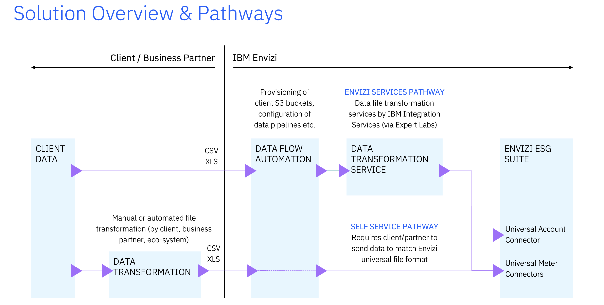

# Data flow Automation Serivces

1. Dataflow automation for sending UDC Excel to AWS S3 bucket in Envizi
https://developer.ibm.com/tutorials/awb-sending-udc-excel-to-s3/

2. Integrate IBM Turbonomic data with IBM Envizi using Envizi Integration Hub
https://developer.ibm.com/tutorials/awb-integrate-turbonomic-with-envizi/